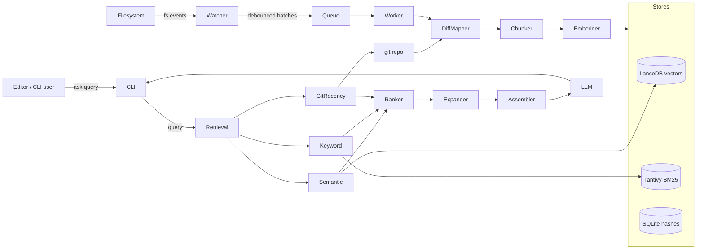

# Local Code Intelligence Engine (LCIE) - Implementation Plan

## Tech Stack Decisions

These libraries cover the spec's components without standing up a server. All are pure-local.

- Language: Python 3.11+, packaged with `pyproject.toml` (managed via `uv` or `pip`).
- Embeddings: `sentence-transformers` with a code-aware default (`jinaai/jina-embeddings-v2-base-code`, fallback `all-MiniLM-L6-v2`). Wrapped behind an `Embedder` interface so Ollama / OpenAI can be swapped in later.
- Vector store: `lancedb` - embedded, file-based, supports metadata filtering and ANN; no separate server needed.
- Keyword/symbol search: `tantivy` (Python bindings) for BM25 over chunk text + symbols; `tree-sitter` + `tree-sitter-languages` for AST-based chunking and symbol extraction.
- File watcher: `watchdog`.
- Git: `pygit2` (fast libgit2 bindings) for diff/status/log; shell `git` as fallback.
- CLI: `typer` + `rich`.
- LLM interface: `httpx`-based client with adapters for Ollama (default) and OpenAI-compatible endpoints.
- Concurrency: `asyncio` for the watcher/queue; `concurrent.futures.ProcessPoolExecutor` for CPU-bound chunking/embedding batches.
- Tests: `pytest`, with a small fixture repo under `tests/fixtures/sample_repo/`.

If you'd prefer Chroma/Qdrant over LanceDB, or `gitpython` over `pygit2`, flag it before I implement.

## Repository Layout

New top-level folder `lcie/` (sibling to `katalog/`, `Utils/`, etc.).

```
lcie/
  pyproject.toml
  README.md
  src/lcie/
    __init__.py
    config.py            # Pydantic settings, weights, paths, debounce window
    cli.py               # typer entrypoint: ask / refresh / status / index / watch
    indexer/
      __init__.py
      scanner.py         # walks repo, respects .gitignore
      chunker.py         # tree-sitter AST chunking + line-window fallback
      symbols.py         # extracts function/class names per chunk
      pipeline.py        # orchestrates scan -> chunk -> embed -> upsert
    embeddings/
      __init__.py
      base.py            # Embedder protocol
      sentence_tx.py     # sentence-transformers impl
      ollama.py          # optional Ollama impl
    store/
      __init__.py
      schema.py          # LanceDB table schema (Data Model section 6)
      vector_store.py    # upsert/query/delete by file_path or chunk_id
      keyword_store.py   # tantivy index wrapper (BM25 + symbol field)
      hash_cache.py      # sqlite of {chunk_id: content_hash} for invalidation
    retrieval/
      __init__.py
      semantic.py        # cosine top-K from LanceDB
      keyword.py         # tantivy query + symbol scoring rules (sec 7.2)
      git_recency.py     # exp(-lambda*age) + dirty/recent commit boosts
      ranker.py          # weighted hybrid score + dedup penalty (sec 7)
      expander.py        # neighbors, imports, related symbols
      assembler.py       # dedup, trim to token budget, build prompt
      fallback.py        # low-confidence -> progressive scope expansion
    git/
      __init__.py
      diff.py            # pygit2 wrapper: changed files + line ranges
      mapper.py          # map changed lines to existing chunks
    watcher/
      __init__.py
      events.py          # watchdog event source
      queue.py           # debounce + coalesce + priority + backpressure
      worker.py          # consumes queue, calls indexer.pipeline
    llm/
      __init__.py
      client.py          # Ollama/OpenAI-compatible adapter
  tests/
    fixtures/sample_repo/
    test_chunker.py
    test_ranker.py
    test_git_mapper.py
    test_watcher_queue.py
    test_e2e_ask.py
```

## Data Model (LanceDB table `chunks`)

Implements section 6 verbatim.

- `chunk_id: str` (uuid or `sha1(file_path:start_line:end_line)`)
- `file_path: str`
- `content: str`
- `embedding: vector(dim)`
- `hash: str` (sha256 of content)
- `start_line: int`
- `end_line: int`
- `symbols: list[str]`
- `language: str`
- `last_updated: timestamp`
- `git_last_commit_ts: timestamp` (for `S_git`)

A separate Tantivy index mirrors `chunk_id`, `content`, `symbols`, `file_path` for keyword/BM25 queries. A small SQLite `hash_cache` keeps `{chunk_id -> hash}` for fast invalidation checks.

## Architecture Flow



## Implementation Phases (mapped to spec timeline)

### Phase 1 - Week 1-2: Foundation (sections 4.1, 4.2, 5.1)

- Set up `pyproject.toml`, package skeleton, config (`config.py` with default weights from sec 7.5).
- `scanner.py` walks repo with `pathspec` honoring `.gitignore`.
- `chunker.py`: tree-sitter AST chunking for Python/JS/TS/Go/Rust/Java; fallback fixed-window (e.g., 40 lines, 10-line overlap) for unsupported languages.
- `embeddings/sentence_tx.py` with batched encoding.
- `store/vector_store.py` LanceDB upsert/query; `hash_cache.py` SQLite.
- `cli.py`: `lcie index <path>` and `lcie ask "<q>"` (semantic-only path end-to-end).
- Tests: chunker, vector roundtrip, simple ask returns plausible chunks.

### Phase 2 - Week 3: Hybrid retrieval + ranking (sections 4.3, 4.4, 7)

- `store/keyword_store.py` Tantivy index built alongside vector upsert.
- `retrieval/keyword.py` implements section 7.2 heuristics (1.0/0.7/0.4/0.0 + boosts).
- `retrieval/semantic.py` returns normalized cosine in [0,1].
- `retrieval/git_recency.py` computes `S_git = exp(-lambda * age_days)` plus +0.2 dirty / +0.1 recent-N-commits.
- `retrieval/ranker.py`:
  - `score = w_s*S_sem + w_k*S_kw + w_g*S_git - w_d*penalty_dup` (sec 7).
  - Dedup penalty via overlap ratio of `(file_path, line ranges)`.
  - Diversity: cap chunks per file in top-K.
- Wire into CLI; expose weights via `config.py` / env vars / `lcie config set`.
- Tests: golden-file ranking tests with synthetic scores.

### Phase 3 - Week 4: Incremental + git-aware updates + watcher (sections 4.7, 5.3, 8, 9)

- `git/diff.py`: `pygit2` wrapper returning `{file_path: [(start, end), ...]}` for working tree vs HEAD and HEAD vs HEAD~N.
- `git/mapper.py`: map diff hunks to existing chunks via `start_line`/`end_line` overlap; classify modified/new/deleted/renamed.
- `indexer/pipeline.py.update_from_diff()`:
  - Modified -> invalidate overlapping chunks, re-chunk affected regions, re-embed.
  - New -> full chunk + embed.
  - Deleted -> delete from both stores by `file_path`.
  - Renamed (same content hash) -> metadata-only update.
  - Large diff (>30-40% of file) -> full file re-index (sec 9 fallback).
- `watcher/queue.py` (sec 9 "Auto-save / High-frequency"):
  - Debounce window 300-1000ms (configurable).
  - Coalesce per-file: keep only latest event.
  - Priority lanes: actively-edited > recent > background-validation.
  - Backpressure: bounded queue + drop superseded jobs; cap concurrent embed jobs.
- `watcher/worker.py` consumes queue and calls `update_from_diff`.
- `lcie watch` CLI command; `lcie refresh` for one-shot re-sync.
- Periodic validation job (sec 8): walks `hash_cache`, recomputes hashes, repairs drift.
- Tests: queue debounce/coalesce/backpressure; mapper edge cases; rename detection.

### Phase 4 - Week 5: Context expansion, assembler, fallback, LLM (sections 4.5, 4.6, 7 expansion, 10)

- `retrieval/expander.py`:
  - Neighbor lines (configurable +/- N lines, clamped to file).
  - Import block extraction per language.
  - Related symbols: pull chunks containing referenced function/class names found in selected chunks.
- `retrieval/assembler.py`:
  - Token-budgeted assembly using `tiktoken` (or model-specific tokenizer).
  - Final dedup, header per chunk (`# file:lines`), order by score.
- `retrieval/fallback.py` (sec 10):
  - If top score < threshold or user passes `--deep`, progressively widen K, lower thresholds, pull recent git diff context.
  - Special intents: `lcie ask --since HEAD~5 "..."` injects recent diff/commit messages.
- `llm/client.py`: Ollama default, OpenAI-compatible adapter; streaming response to CLI via `rich`.
- CLI polish: `lcie status` (index size, last update, chunk counts, weight values).
- E2E test against `tests/fixtures/sample_repo/` asserting expected files appear in retrieved context.

## Configuration (defaults, all overridable)

Lives in `~/.lcie/config.toml` per workspace, overridable via env vars and `lcie config`.

- `weights`: `w_s=0.5, w_k=0.3, w_g=0.2, w_d=0.1` (sec 7.5).
- `git.lambda=0.15`, `git.recent_commits=10`.
- `chunk.max_lines=80`, `chunk.overlap=10`.
- `retrieval.top_k=8`, `retrieval.per_file_cap=2`.
- `watcher.debounce_ms=500`, `watcher.max_concurrent_embeds=2`.
- `embedder.model="jinaai/jina-embeddings-v2-base-code"`.
- `llm.provider="ollama"`, `llm.model="llama3.1"`.

## Success Metrics Hooks (sec 14)

Add lightweight telemetry to a local JSONL log (`~/.lcie/metrics.jsonl`):

- token counts (query, context, response) per `ask`,
- latency breakdown (embed, semantic, keyword, rank, expand, llm),
- retrieval set composition (per-file, per-score-component).

A `lcie status --metrics` summarises last N queries.

## Out of Scope (sec 3 + future work)

- No LSP/editor extension in this plan - CLI only. Editor integration is a follow-up that consumes the same `retrieval` API.
- No multi-repo, call graph, blame reasoning, shared team index (sec 13).

## Open Questions to Confirm Before Coding

1. Vector store: LanceDB OK, or do you prefer Chroma / Qdrant-local / sqlite-vss?
2. Default LLM provider: assume Ollama on `localhost:11434`?
3. OS focus: Windows is primary (your current OS) - confirm we should test/ship watcher + pygit2 on Windows first.
